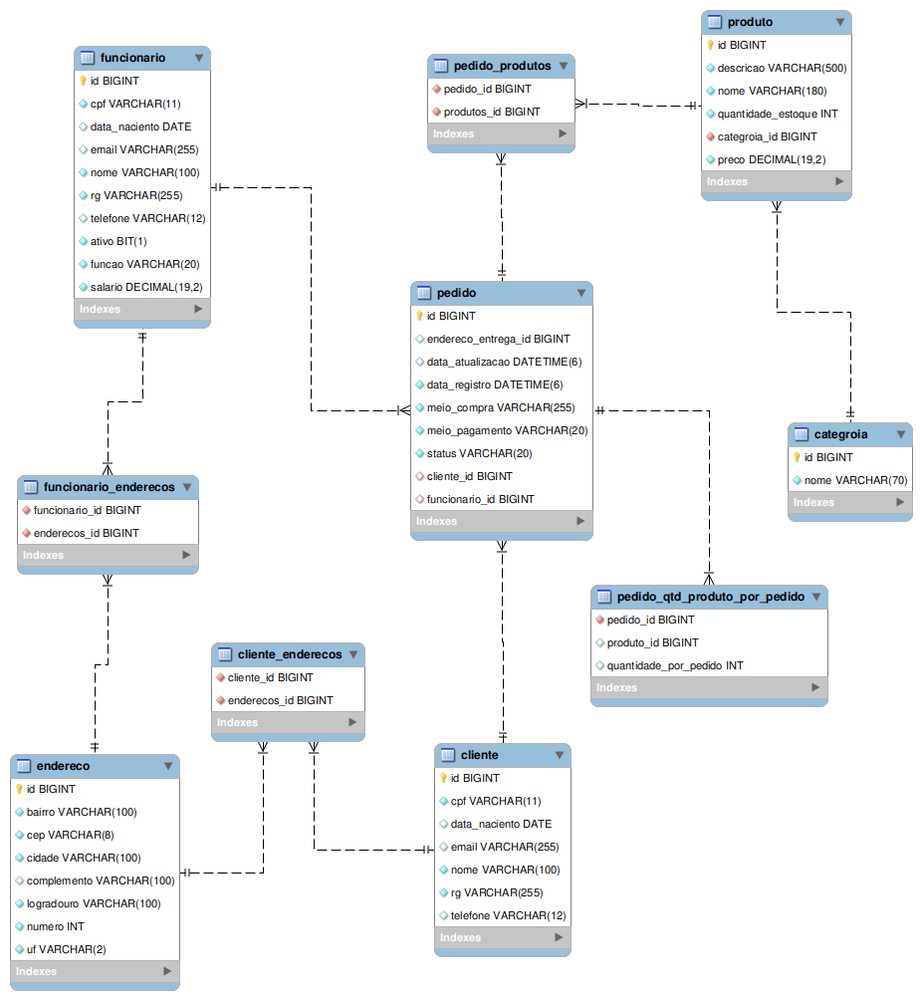

# Projeto final - MJV School

Desenvolvido com java e Spring Boot trata-se de uma aplicação REST para controle de estoque.

## Intalação e execução
Na raiz do projeto execute os seguintes comandos:
- Instalação: `mvn install`.
- Execução: `java -jar target/projeto-final-0.0.1-SNAPSHOT.jar `

---

## Ferramentas e dependências que compõe projeto
- `Spring Boot`: Framework java para o desenvolvimento de aplicações REST e RESTFull; Dentre outras coisas facilita a configuraçâo de projetos java que antes eram feitas de forma manual e tediosa;
- `JPA`: Uma API da linguágem java que descreve uma interface comum para frameworks de persistência de dados - [Wikipedia](https://pt.wikipedia.org/wiki/Java_Persistence_API);
- `Hibernate Validator`: O Hibernate Validator permite expressar e validar restrições de aplicativos. A fonte de metadados padrão são anotações, com a capacidade de substituir e estender por meio do uso de XML - [Hibernate.org](http://hibernate.org/validator/);
- `MySql`: Banco de dados relacional atualmente mantido pela Oracle;
- `Swagger`: Conjunto de ferramenta que facilita o projeto e a documentação de APIs - [Swagger](https://swagger.io/);
- `Lombok`: Biblioteca java que facilita a criação de métodos getters, setter, equals e outros por meio de anotações trabalhando integrado à sua IDE - [Projeto Lombok](https://projectlombok.org/)

---

## Estrutura do projeto 
Por se tratar de uma aplicação REST a mesma foi desenvolvida baseada em camadas. Veja abaixo uma breve descrição de cada camada do projeto.

### Camada de modelo (model)
Nessa camada foram mapeadas as entidades que compõe as regras de negócio da aplicação. Existem dois subpacotes nessa camada. São eles `embeddable` e `entity`.
Veja abaixo uma descrição de cada um desses subpacotes:
- `embeddable`: Esse pacote contem as classes e enumeráveis (enum) que não serão mapeadas como entidades, mas sim encorporadas por outras classes. A exemplo temos a classe `Log` que tem a finalidade de registrar dados de dada/hora de criação e atualização de uma entidade `Pedido`. Para facilitar o desenvolvimento e a manutenção do projeto esses registros foram separados em uma classe individual, mas no banco de dados eles são persistidos em uma única entidade `pedido`.
- `entity`: Esse pacote contem as classes que mapeam entidades do banco de dados. Nesse pacote há algumas classes abstratas, como a classe `Pessoa`, que mapea dados repetidos nas entidades `Cliente` e `Funcionario` como nome, cpf, telefone e outros. Existe também uma classe abstrata denominada `DataBaseEntity` cuja sua utilidade será abordada mais adiante.

### Camada de repositórios (repository)
Nessa camada são definidas as interfaces JPA responsáveis pela persistência dos dados na base de dados. Alem dos métodos convencionais ja disponiveis foram definidos metodos especiais para algumas dessas interfaces com a finalidade de atender necessidades específicas das regras de negócio da aplicação. Tais métodos são declarados com nomes bastante descritivos, cuja API JPA é capas de entender exatamente qual ação deve ser tomada apenas com base no nome do método. Veja abáixo alguns exemplos:
```java
// findByClienteId: busca um pedido com base no ID do cliente.
// findByFuncionarioId: busca um pedido com base no ID do funcionario responsavel pela venda.
@Repository
public interface PedidoRepository extends JpaRepository<Pedido, Long> {
    @Query("select p from Pedido p where p.cliente.id = :id")
    List<Pedido> findByClienteId(@Param("id") Long id);

    @Query("select p from Pedido p where p.funcionario.id = :Id")
    List<Pedido> findByFuncionarioId(@Param("Id") Long Id);
}
```
```java
// findByDescricaoIgnoreCaseLike: busca produtos com base em uma palavra chave contida na descrição.
// findByNomeIgnoreCaseLike: busca produtos com base em uma palavra chave contida no nome do produto.
@Repository
public interface ProdutoRepository extends JpaRepository<Produto, Long> {
    @Query("select p from Produto p where upper(p.descricao) like upper(concat('%', :substring, '%'))")
    List<Produto> findByDescricaoIgnoreCaseLike(@Param("substring") String substring);

    @Query("select p from Produto p where upper(p.nome) like upper(concat('%', :substring, '%'))")
    List<Produto> findByNomeIgnoreCaseLike(@Param("substring") String substring);
}
```
As demais interfaces dessa camada seguem as implementações convencionais, por tanto não seram citados exemplo referentes a elas.

### Camada de serviços (service)
Essa camada implementa as regras de negócio da aplicação. Para facilitar a implementação e evitar código repetido foi implementada uma classe abstrata chamada `TemplateCrudService`. Nessa classe foram definidos os métodos basicos de um crud, que seram herdados por qualquer classe que a extenda. Essa implementação é feita baseada em um padrao de projeto comportamental denominado ***Template Method*** cujo objetivo é definir esqueletos de algoritmos em uma classe base permitindo que subclasses façam o reuso dessas implementações ou, se for o caso, sobrescreva tais implementações sem que o comportamento geral seja afetado. As subclasses são livres para sobrescrever esses métodos predefinidos caso uma implementação diferente senja necessária.
Abaixo uma descrição de como essa classe template é estruturada:
```java
public abstract class TemplateCrudService<T extends DataBaseEntity> {

    protected final JpaRepository<T, Long> repository;

    public TemplateCrudService(JpaRepository<T, Long> repository) {
        this.repository = repository;
    }

    public T salvar(T entity) throws EntidadeImprocessavelException {
        if(entity.getId() != null){
            throw new EntidadeImprocessavelException("o parametro id nao deve ser especificado");
        }
        return repository.save(entity);
    }
    
    // ... Demais métodos
}
```
Podemos notar que essa classs baseia-se em um tipo `T` genérico que extende a classe abstrata `DataBaseEntity`. Essa classe tem como responsabilidade determinar que toda entidade mapeada deve conter uma implementação do método abstrato `getId()`. Essa classe se faz necessária pois deve haver uma garantia que o tipo genérico `T` possui um método `getId()` implementado, como foi citado anteriormente. Abaixo vemos o exemplo da classe `DataBaseEntity`:
```java
public abstract class DataBaseEntity {
    public abstract Long getId();
}
```

Um exemplo de classe que extende a classe `TemplateCrudService` pode ser visto abaixo:
```java
@Service
public class ClienteService extends TemplateCrudService<Cliente> {

    @Autowired
    public ClienteService(ClienteRepository repository) {
        super(repository);
    }
}
```
Podemos observar que, para que uma classe de serviço implemente os métodos CRUD basicos so é necessario que ela extenda a classe de template, informe qual entidade essa classe de serviço é responsavel, injete as dependencias atravez do construtor, e pronto.

Caso alguma das subclasses precise de uma implementação diferenta a mesma pode conter uma sobreescrita dos métodos padrões. Caso precise de métodos alem dos convencionais é so implementalos, como no exemplo abaixo:
```java
@Service
public class PedidoService extends TemplateCrudService<Pedido> {
    private final PedidoRepository repository;

    @Autowired
    private ProdutoRepository produtoRepository;

    @Autowired
    public PedidoService(PedidoRepository repository) {
        super(repository);
        this.repository = (PedidoRepository) super.repository;
    }

    @Override
    public Pedido salvar(Pedido pedido) throws EntidadeImprocessavelException {
        Log log = new Log();
        log.setDataRegistro(new Date());
        log.setDataAtualizacao(new Date());
        pedido.setLog(log);
        for(Produto p : pedido.getProdutos()) {
            for (QtdProdutoPorPedido produtoPedido:  pedido.getQtdProdutoPorPedido()) {
                if(p.getId().equals(produtoPedido.getProdutoId())) {
                    Produto produtoCorrente = produtoRepository.findById(p.getId()).get();
                    decrementarQtdProdutoEstoque(produtoCorrente, produtoPedido.getQuantidadePorPedido());
                    p = produtoRepository.save(produtoCorrente);
                }
            }
        }

        return super.salvar(pedido);
    }

    public List<Pedido> buscarPorFuncionarioId(Long funcionarioId) {
        List<Pedido> pedidos = repository.findByFuncionarioId(funcionarioId);
        if(pedidos.isEmpty()) {
            throw new RecursoNaoEncontradoException("nao ha pedidos associados a esse funcionario");
        }
        return pedidos;
    }
}

```

### Camada de exceções (exceptions)
A camada de serviços pode receber dados invalidos e não saber como lidar com eles. Pensando nisso foram implementadas algumas classes de exceções para facilitara o tratamento de erros na aplicação. As exceções previstas nessa camada são citadas abaixo:
```java
public class EntidadeImprocessavelException extends RuntimeException {
    public EntidadeImprocessavelException() {
        super("Entidade improcessavel. Verifique os dados enviados");
    }

    public EntidadeImprocessavelException(String message) {
        super(message);
    }
}
```
```java
public class RecursoNaoEncontradoException extends RuntimeException {
    public RecursoNaoEncontradoException() {
        super("recurso nao encontrado");
    }

    public RecursoNaoEncontradoException(String message) {
        super(message);
    }
}
```
```java
public class RepositorioVazioException extends RuntimeException {
    public RepositorioVazioException() {
        super("repositorio vazio");
    }

    public RepositorioVazioException(String message) {
        super(message);
    }
}
```

Tais classes de exceção possuem dois construtores. Um deles não recebe parâmetro e lança uma mensagem padrão e o outro recebe uma mensagem como parâmetro:

### Tratamento de exceções
A camada de controladores REST (controller), que será descrita abaixo, possui uma classe denominada `ManipuladorGlobalDeExcecoes` com a responsabilidade de tratar globalmente possiveis exceções lançadas na camada de serviço ou por dados não aprovados pelas anotações de validação. Vejamos como essas exceções são tratadas.
```java
@ControllerAdvice
public class ManipuladorGlobalDeExcecoes {

    @ExceptionHandler({
            EntidadeImprocessavelException.class,
            ValidationException.class,
            SQLException.class
    })
    public ResponseEntity<?> entidadeImprocessavelHandler(Exception e) {
        return ResponseEntity
                .status(HttpStatus.UNPROCESSABLE_ENTITY)
                .body("{\"error\": \"" + e.getMessage() +"\"}");
    }

    @ExceptionHandler({RecursoNaoEncontradoException.class, RepositorioVazioException.class})
    public ResponseEntity<?> recursoNaoEncontradoHandler (Exception e) {
        return ResponseEntity.noContent().build();
    }
}
```
A classe `ManipuladorGlobalDeExcecoes` possui métodos responsaveis por enviar respostas com status http e menságens adequadas para cada situação.

### Camada de controladores REST (controller)
A camada de controladores segue uma implementação de template identica à camada de serviço. Por tanto não será abordada com profundidade. Abaixo podemos ver um pequeno exemplo da classe `TemplateCrudController` e uma das classes que a extendem, seguindo basicamente os mesmos padrões da camada de serviço:
```java
public abstract class TemplateCrudController<T extends DataBaseEntity> {

    protected final TemplateCrudService<T> service;

    public TemplateCrudController(TemplateCrudService<T> service) {
        this.service = service;
    }

    @PostMapping
    @Operation(summary = "Registrar nova entidade")
    public ResponseEntity<T> salvar(@RequestBody T entity) throws EntidadeImprocessavelException {
        return ResponseEntity.status(HttpStatus.CREATED).body(service.salvar(entity));
    }
    
    // ... demais métodos
}
```
```java

@RestController
@RequestMapping(value = "/clientes", produces = "application/json;charset=UTF-8")
public class ClienteController extends TemplateCrudController<Cliente> {

    @Autowired
    public ClienteController(ClienteService service) {
        super(service);
    }
}

```

### Camada de configurações (config)

A camada de configurações possui um unico método responsável por inicializar a aplicação com um timezone especifico. Sua implementação pode ser vista abaixo:
```java
@Configuration
public class LocaleConfig {

    @PostConstruct
    public void init() {
        TimeZone.setDefault(TimeZone.getTimeZone("GMT-3:00"));
        System.err.println(new Date());
    }
}

```

---

## Endpoints e documentação API
Apos a aplicação ser executada é possivel acessar e analizar a documentação de cada enpoint da API atravez da ferramenta Swagger. Link da documentação: http://localhost:8080/swagger-ui/index.html#/;

---

## Diagrama Entidade Relacionamento
O seguinte diagrama reflete o estado do banco de dados da aplicação, suas entidades e relacionamentos:
